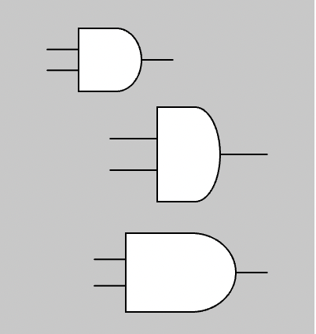
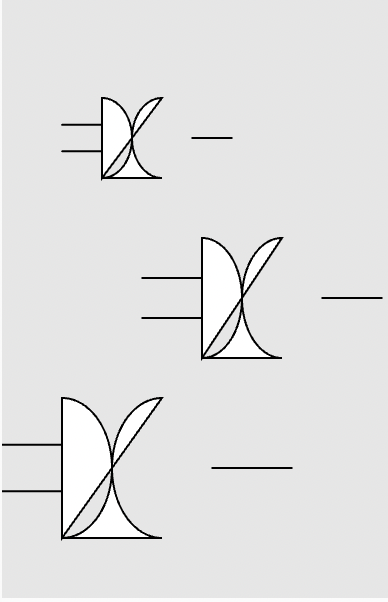

# Drawing Gates

We will be using the Processing version 5 JavaScript library for doing web-based drawing.  This is called
the [p5.js](https://p5js.org/) library.  Because
Processing has been around since 2000 there is able code that generative AI has been trained on.  Getting
the correct results is pretty easy. 

We need a library for drawing gates in our simulators.
We use the following drawing conventions:

The standard function parameters are:

1. X position on the canvas
2. Y position on the canvas
3. Width of the gate (not including connecting wires)
4. Height of the gate
5. Length of the connecting wires

The drawing must be made so that the fill color, stroke color, and stroke can all be inherited from the drawing context.

## Drawing basic

### Buffer

We will start with a simple buffer logic gate that
does not change the input signal.  We use a triangle shape to draw a buffer.

### Sample Buffer Prompt

```linenums="0"
Create a p5.js function called drawBuffer(x,y,w,h,l) for a logic buffer symbol.  The function should take parameters x, y, width, height and wire length.
Place the logic gate with the upper left corner of the triangle at the point x,y with a width and height from the parameters.  Add wire length as input and output wires.

Create a test of this function on a 200x300 canvas drawing three examples of the drawBuffer using different sizes.

Draw the tests on a lightgray background.
```

[ChatGPT Dialog using the p5.js Visual Art Composer](https://chat.openai.com/share/7cd52558-2636-40f6-a983-eadaa1f10011)

### Sample Buffer Response


```ps
// Draw Buffer Function
function setup() {
  createCanvas(200, 300);
  background('lightgray');
  drawBuffer(50, 50, 30, 40, 20);
  drawBuffer(100, 120, 40, 60, 30);
  drawBuffer(30, 200, 50, 70, 40);
}

function drawBuffer(x, y, w, h, l) {
  
  // Draw input wire
  line(x - l, y + h / 2, x, y + h / 2);

  // Draw the buffer (triangle)
  triangle(x, y, x, y + h, x + w, y + h / 2);

  // Draw output wire
  line(x + w, y + h / 2, x + w + l, y + h / 2);
}
```

[Edit this MicroSim on p5.js Editor](https://editor.p5js.org/dmccreary/sketches/BfQTHHj90)

## Drawing an Inverter

### Inverter Prompt

```linenums="0"
That was perfect!
Now create a new function called drawInverter.
It will have exactly the same input parameters,
but the drawing will have a small circle at the
right tip of the triangle.

Draw the tests on a lightgray background.
```

### Inverter Response


```js
// Draw Inverter
// Test the drawInverter function with different sizes

function setup() {
  createCanvas(200, 300);
  background(240); // light gray background
  drawInverter(50, 50, 30, 40, 20);
  drawInverter(100, 120, 40, 60, 30);
  drawInverter(30, 200, 50, 70, 40);
}

function drawInverter(x, y, w, h, l) {
  // Draw input wire
  line(x - l, y + h / 2, x, y + h / 2);

  // Draw the buffer (triangle)
  triangle(x, y, x, y + h, x + w, y + h / 2);

  // Draw output wire
  line(x + w, y + h / 2, x + w + l, y + h / 2);

  // Draw small circle at the right tip of the triangle
  circle(x + w, y + h / 2, w / 5);
}
```

### Sample AND Prompt

```linenums="0"
That was also perfect!
Now create a new function called drawAND that will draw
a AND logic gate.
This will be similar to the previous functions,
but instead of drawing a triangle you will need
to make the right side of the shape a circle.
Place a series of points on the canvas using the vertex(x,y) function that makes the correct shape.
Use beginShape() and endShape() around the points.
```

### Sample AND Response



```js
// Draw And Logic Gate
// Test the drawAND function with different sizes

function setup() {
  createCanvas(200, 300);
  background(200); // light gray background
  drawAND(50, 20, 40, 40, 20);
  drawAND(100, 70, 40, 60, 30);
  drawAND(80, 150, 70, 50, 20);
}

function drawAND(x, y, w, h, l) {
  // Draw input wires
  line(x - l, y + h / 3, x, y + h / 3);
  line(x - l, y + 2 * h / 3, x, y + 2 * h / 3);

  // Draw the AND gate shape
  beginShape();
  vertex(x, y); // top left corner
  vertex(x + w * 0.6, y); // top right corner (start of semicircle)
  // Create semicircle
  for (let angle = -HALF_PI; angle <= HALF_PI; angle += 0.01) {
    let sx = x + w * 0.6 + cos(angle) * w * 0.4;
    let sy = y + h / 2 + sin(angle) * h / 2;
    vertex(sx, sy);
  }
  vertex(x + w * 0.6, y + h); // bottom right corner (end of semicircle)
  vertex(x, y + h); // bottom left corner
  endShape(CLOSE);

  // Draw output wire
  line(x + w, y + h / 2, x + w + l, y + h / 2);
}
```

## Failed Attempts at OR Gate



This is where GPT-4 falls apart.  Despite
my best attempts, I could not get GPT-4
to correctly draw the complex curves needed
for a logical OR gate.  You can see the
results in the transcript.

I had to resort to manually drawing the
curves, which was a slow-painful process
and took several hours to make it
robust enough that it could work with
a variety of sizes.

I think this really demonstrates the limits
of what GPT-4 is capable of, and what it
can't do.


[Edit the Logical OR gate MicroSim](https://editor.p5js.org/dmccreary/sketches/uVb20rFLC)

One hint that GPT-4 did give was to use the map function
to have the x-coordinates move linearly and only use
the sin() functions on the y-coordinates.  This worked
reasonably well and the curves do match up pretty
closely with the official [SVG drawing](https://upload.wikimedia.org/wikipedia/commons/b/b5/OR_ANSI.svg) of the OR gate.
If you want a precise mapping you can also write a program
that converts the SVG points to a set of (x,y) points.

## NOR Symbol Prompt


Once we have a good OR gate, we can ask GPT to
just use that to create a NOR gate.  All
it has to do is add a circle on the output.

Here is the [code it generated](https://chat.openai.com/share/de86221d-6d59-4f54-8a53-d93b3682378c):

```js
function drawNOR(x, y, w, h, l) {
  // Draw the OR part
  drawOR(x, y, w, h, l);

  // Draw the NOT circle at the output
  let outputX = x + w + l * 0.5;
  let outputY = y + h / 2;
  let circleRadius = l * 0.3;
  ellipse(outputX, outputY, circleRadius, circleRadius);
}
```

So it is clear that GPT-4 has been trained on how
to add a small bit of drawing to an existing function.

Note that it tends to use ellipse() rather than circle().