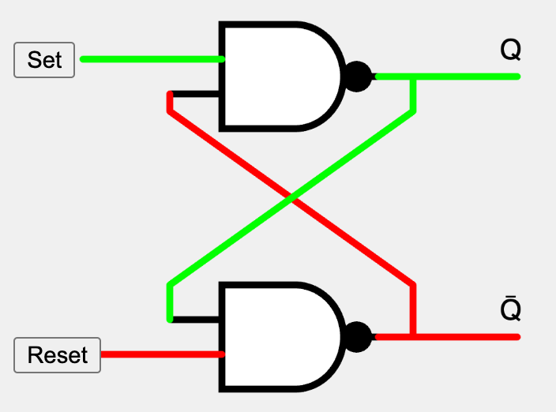

# Flip Flop MicroSim

{ width="400" }

[Run the Flip Flop MicroSim](flip-flop.html){ .md-button .md-button--primary }
[Edit the Flip Flop MicroSim](https://editor.p5js.org/dmccreary/sketches/AwlOJNtQd)

## Challenges 

Explaining electronic components like flip-flops through animation can be challenging due to several reasons:

1.  **Abstract Concepts**: Flip-flops are digital logic circuits used in electronics and computing. They store and manipulate binary data (0s and 1s). The concepts involved in how they work---like logic gates, binary states, clock signals, and data storage---are abstract and not directly observable, making them hard to represent visually.

2.  **Complex Functionality**: Flip-flops have different types (like SR, JK, D, and T flip-flops) and each type has its unique mode of operation. This complexity can be difficult to condense into a simplified animation without losing essential details.

3.  **Timing and Synchronization**: Flip-flops often operate based on clock signals, and their behavior is dependent on the timing of these signals. Accurately depicting timing and synchronization in an animation can be challenging, as it requires precise representation of these temporal aspects.

4.  **Scale and Interaction with Other Components**: Flip-flops are usually part of larger electronic systems. Showing how they interact with other components in a system (like processors or memory units) within the limited scope of an animation can be difficult, as it might require a broader context that is hard to visualize succinctly.

5.  **Viewer Background Knowledge**: Understanding the operation of flip-flops often requires a background in electronics or computer science. Animations need to be designed considering the viewer's prior knowledge, which can vary widely, making it hard to create a one-size-fits-all explanation.

6.  **Visual Simplicity vs. Technical Accuracy**: Striking the right balance between simplicity for easier understanding and technical accuracy for correctness is a major challenge. Over-simplification can lead to misconceptions, while too much detail can overwhelm the viewer.

To effectively use animation for explaining flip-flops, it's essential to focus on clear, step-by-step visual representations, using metaphor or analogy where possible, and providing sufficient explanatory context to make the abstract concepts more relatable.
## References

* [Falstage Flip-Flop Simulator](https://www.falstad.com/circuit/e-nandff.html)
* [WikiPedia Page on Flip Flops](https://en.wikipedia.org/wiki/Flip-flop_(electronics))