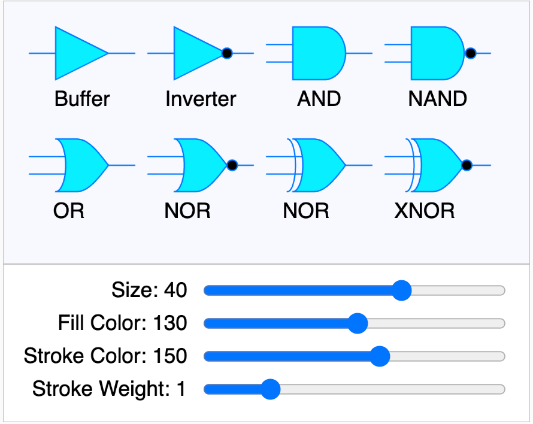

# Logical Gate Simulations

{ width="400" }

[Run the Logic Gates MicroSim](./template.html){ .md-button .md-button--primary }
[Edit the Logic Gates MicroSim](https://editor.p5js.org/dmccreary/sketches/SpFEWepWj)

Our goal in this simulation is to:

1. Use generative AI to build a library
of high-quality logical gate drawings using
the p5.js library.
2. Use this library to build a logic simulator
that can simulate simple digital logic gates.

[Drawing Gates](./01-drawing-gates.md)